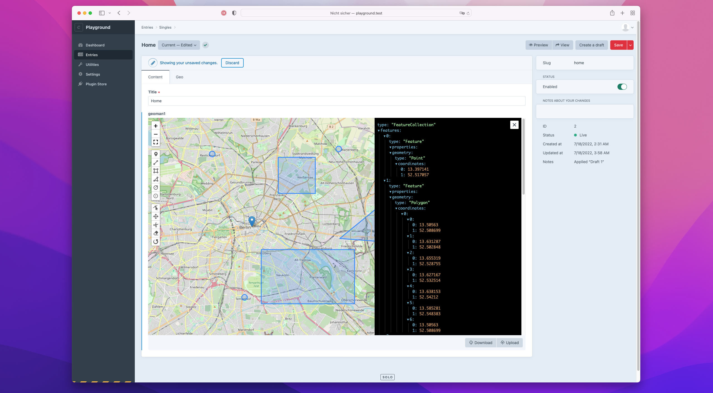

<p>

</p>

<h1>Craft Geoman</h1>

This plugin adds a “Geoman” field type to Craft CMS, which provides geometry editing powered by [leaflet-geoman](https://geoman.io/leaflet-geoman) by geoman.io.

<p>

</p>

## Requirements

This plugin requires Craft CMS 4.0 or later.

## Installation

You can install this plugin from the Plugin Store or with Composer.

#### From the Plugin Store

Go to the Plugin Store in your project’s Control Panel and search for “Craft Geoman”. Then click on the “Install” button in its modal window.

#### With Composer

Open your terminal and run the following commands:

```bash
# go to the project directory
cd /path/to/my-project

# tell Composer to load the plugin
composer require handplant/craft-geoman

# tell Craft to install the plugin
./craft plugin/install craft-geoman
```

## Simple frontend example

```
<link href="https://unpkg.com/leaflet@1.7.1/dist/leaflet.css" rel="stylesheet" />
<script src="https://unpkg.com/leaflet@1.7.1/dist/leaflet.js"></script>

<div id="map" style="height: 500px; border: 1px solid black;"></div>
<div id="geojson" style="display: none;">
    {{ entry.geoman }}
</div>

<!-- prettier-ignore -->
<script>
var map = L.map(document.getElementById('map')).setView([47.9034, 8.10577], 10);

L.tileLayer('https://{s}.tile.openstreetmap.org/{z}/{x}/{y}.png', {
    attribution: 'Data ©<a href="http://osm.org/copyright">OpenStreetMap</a>',
    maxZoom: 18
}).addTo(map);

var layer = L.featureGroup().addTo(map);

var geojson = document.getElementById('geojson');
if (geojson.innerHTML) {
    var geojsonLayer = L.geoJson(JSON.parse(geojson.innerHTML), {
        pointToLayer: (feature, latlng) => {
            if (feature.properties.radius) {
                return new L.Circle(latlng, feature.properties.radius)
            } else if (feature.properties.shape == "CircleMarker") {
                return new L.CircleMarker(latlng)
            } else {
                return new L.Marker(latlng)
            }
            return
        },
    })
    geojsonLayer.eachLayer(function (l) {
      layer.addLayer(l)
    })
    map.fitBounds(layer.getBounds())
}
</script>
```
